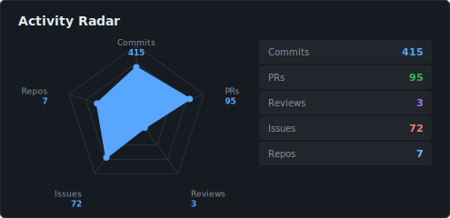
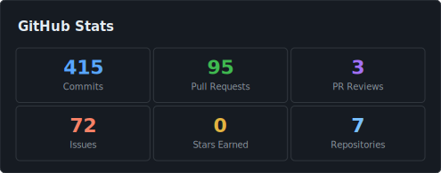
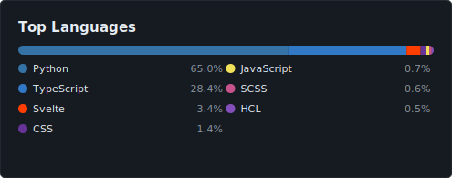

# Hi there 👋 I'm Sora4431

  <picture>
    <source media="(prefers-color-scheme: dark)"  srcset="./output/assets/svg/activity-dark.svg">
    <source media="(prefers-color-scheme: light)" srcset="./output/assets/svg/activity-light.svg">
    
  </picture>
  <picture>
    <source media="(prefers-color-scheme: dark)"  srcset="./output/assets/svg/overview-dark.svg">
    <source media="(prefers-color-scheme: light)" srcset="./output/assets/svg/overview-light.svg">
    
  </picture>

  <picture>
    <source media="(prefers-color-scheme: dark)"  srcset="./output/assets/svg/charts-dark.svg">
    <source media="(prefers-color-scheme: light)" srcset="./output/assets/svg/charts-light.svg">
    
  </picture>

  <picture>
    <source media="(prefers-color-scheme: dark)"  srcset="https://raw.githubusercontent.com/Sora4431/Sora4431/main/output/assets/svg/monthly-dark.svg?v=3">
    <source media="(prefers-color-scheme: light)" srcset="https://raw.githubusercontent.com/Sora4431/Sora4431/main/output/assets/svg/monthly-light.svg?v=3">
    
  </picture>

  

---

## 📊 Daily Market Watch

<!--START_MARKET_DATA-->
| Market | Price | Change | Date |
|--------|-------|--------|------|
| 🇺🇸 **S&P 500** | $6,878.88 | 📉 -29.98 (-0.43%) | 2026-02-27 |
| 🛢️ **WTI Crude** | $67.02/bbl | 📈 +1.81 (+2.78%) | 2026-02-27 |
| 🏦 **US 10Y Yield** | 3.9620% | 📉 -0.0550 (-1.37%) | 2026-02-27 |

### 📊 14-Day Market Trends

<!--END_MARKET_DATA-->

---

  Stats auto-updated weekly via <a href="https://github.com/Sora4431/Sora4431/actions">GitHub Actions</a> · Market data updated daily after US market close

